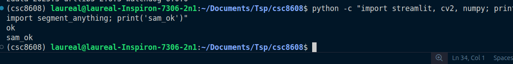
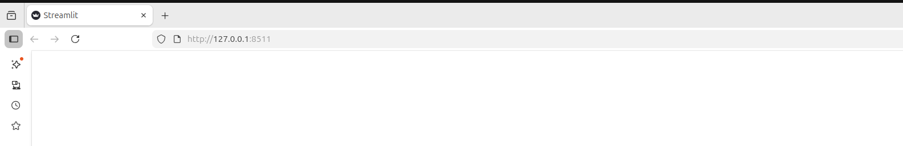
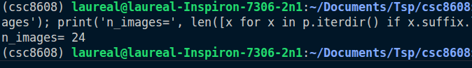

# TP1

## Exercice 1

### Question 1.c

le lien du dépot : https://github.com/LaurealDente/csc8608
endroit d'exécution : local

└── TP1
    ├── data
    │   └── images
    ├── outputs
    │   ├── logs
    │   └── overlays
    ├── README.md
    ├── report
    │   └── report.md
    ├── requirements.txt
    └── src
        ├── app.py
        ├── geom_utils.py
        ├── sam_utils.py
        └── viz_utils.py

### Question 1.e

torch 2.5.1                                                                                                                
cuda_available False                                                                                                       
device_count 0

### Question 1.g

### Question 1.i

port choisi : 8511

court commentaire : accessible sans ssh

## Exercice 2

### Question 2.b

IMG-20230721-WA0000.jpg : Element très simple et prédétouré

20241110_210221.jpg : Intéréssant car il y a beaucoup d'informations

IMG-20230719-WA0015.jpg : Image avec de l'exposition, grand contraste

## Exercice 3

### Question 3.a