# TP1

## Exercice 1

### Question 1.c

le lien du dépot : https://github.com/LaurealDente/csc8608
endroit d'exécution : local

└── TP1
    ├── data
    │   └── img/images
    ├── outputs
    │   ├── logs
    │   └── overlays
    ├── README.md
    ├── report
    │   └── report.md
    ├── requirements.txt
    └── src
        ├── app.py
        ├── geom_utils.py
        ├── sam_utils.py
        └── viz_utils.py

### Question 1.e

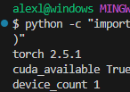

### Question 1.g

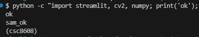

### Question 1.i

port choisi : 8511

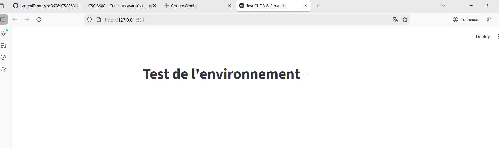

court commentaire : accessible sans ssh

## Exercice 2

### Question 2.b

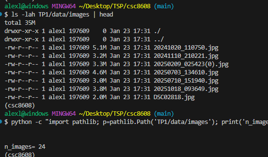

IMG-20230721-WA0000.jpg, IMG-20250425-WA0000.jpeg : Element très simple et prédétouré

20241110_210221.jpg, IMG-20250908-WA0184.jpg : Intéréssant car il y a beaucoup d'informations

IMG-20230719-WA0015.jpg : img/image avec de l'exposition, grand contraste

## Exercice 3

### Question 3.e

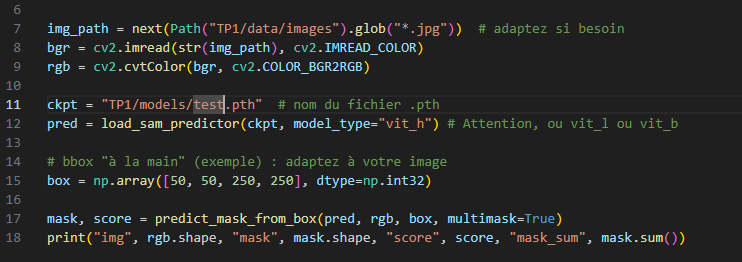


Grâce aux résultats, nous concluons que les indicateurs sont au vert, l'img/image est chargée (3024, 4032, 2) un score de 0.9, le programme a trouvé un objet de 36762 pixels. Celui-ci s'exécute en un temps raisonnable < 1 minute.

## Exercice 4

### Question 4.d

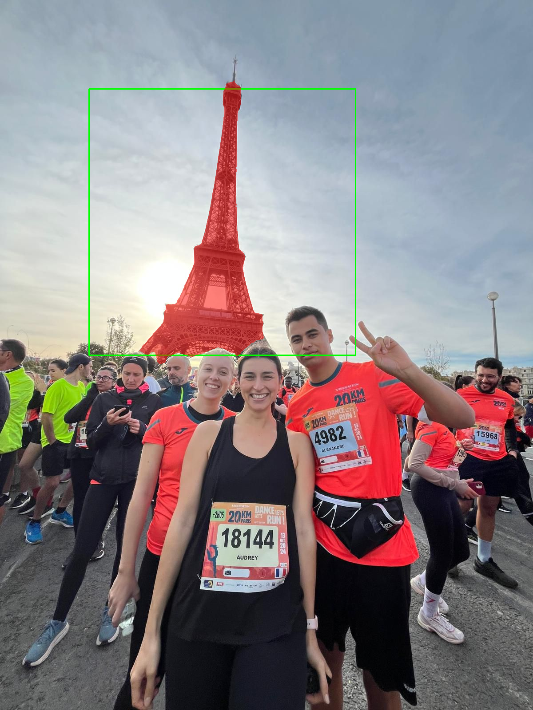

+-----------------------+-------------------------+----------------------------------+
|      Métrique         |         Valeur          |           Description            |
+-----------------------+-------------------------+----------------------------------+
|  Score de confiance   |          0.978          | Indice de précision SAM          |
|  Aire                 |       60 469 px         | Nombre de pixels de l'objet      |
|  BBox (x1,y1,x2,y2)   |  (314, 181, 593, 819)   | Coordonnées limites de l'objet   |
|  Périmètre            |       1 714.41 px       | Longueur du contour              |
+-----------------------+-------------------------+----------------------------------+

Grâce à l'overlay, il est facile de noter les objets que notre modèle a détecté sur l'img/image. Ainsi, nous pouvons modifier les paramètres en conséquence afin que la détection fonctionne.

## Exercice 5

### Question 5.d

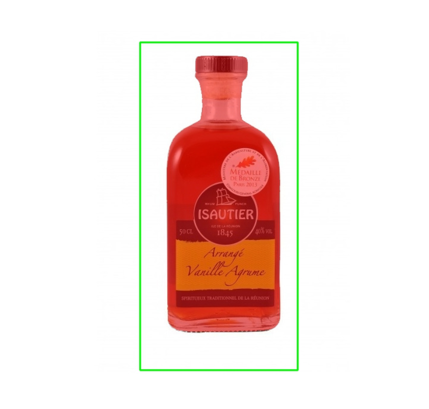
x1 = 239
y1 = 135
x2 = 556
y2 = 646

```python
{
"score":1.015638828277588
"time_ms":1794.910192489624
"area_px":71960
"mask_bbox":[
0:
305
1:
167
2:
494
3:
630
]
"perimeter":1264.9432127475739
}
```


x1 = 667
y1 = 1045
x2 = 823
y2 = 1209

```python
{
"score":0.8379289507865906
"time_ms":1763.6628150939941
"area_px":6052
"mask_bbox":[
0:
718
1:
1058
2:
782
3:
1221
]
"perimeter":408.9777030944824
}
```


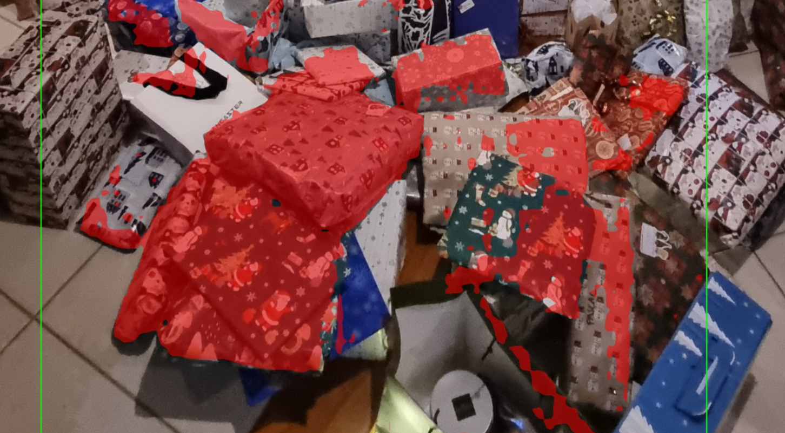
x1 = 169
y1 = 1897
x2 = 1775
y2 = 3442

```python
{
"score":0.7972155213356018
"time_ms":1731.752872467041
"area_px":600463
"mask_bbox":[
0:
263
1:
2004
2:
1764
3:
3405
]
"perimeter":17133.81998550892
}
```

Lorsque les coordonnées de la box sont modifiés, les bordures vertes où la reconnaissance se fait sont modifiées. Il est alors possible de reconaître un objet sur une partir spécifique de l'img/image.

## Exercice 6

### Question 6.j

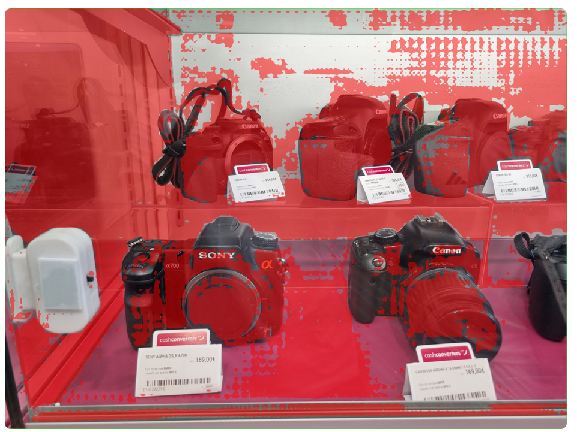

Le masque ne correspond pas aux objets à trouver

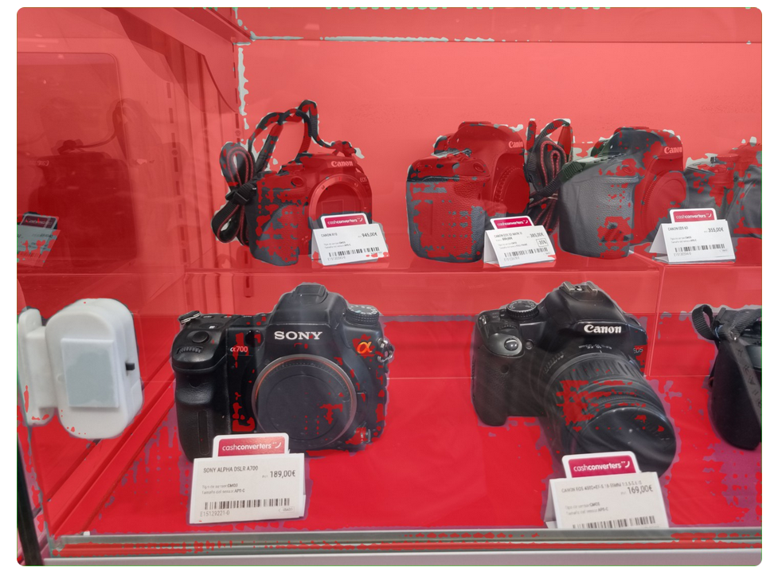

Après l'ajout d'un point FG en plein milieu de l'img/image, il n'y a pas de grande différence de la performance des masques. Par contre il les détourne parfaitement


En déplacant le FG sur une caméra et en ajoutant un BG hors du périmètre de caméra, une amélioration notable survient (meilleur masque -> 1): 

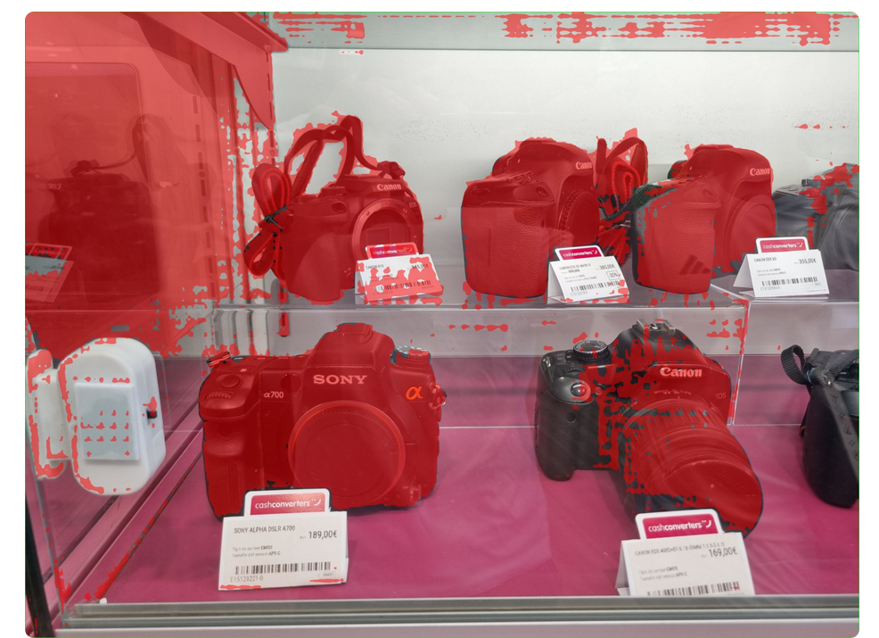

Paramètres des points avec le masque 1 : 

```python

{"n_points":2,"points":[[2274,1892,0],[1386,1892,1]]}

{"mask_idx":1,"score":0.7340875864028931,"area_px":4658124,"mask_bbox":[0,0,4031,3004],"perimeter":69040.37890827656}

```

### Question 6.k

Sans point FG/BG :

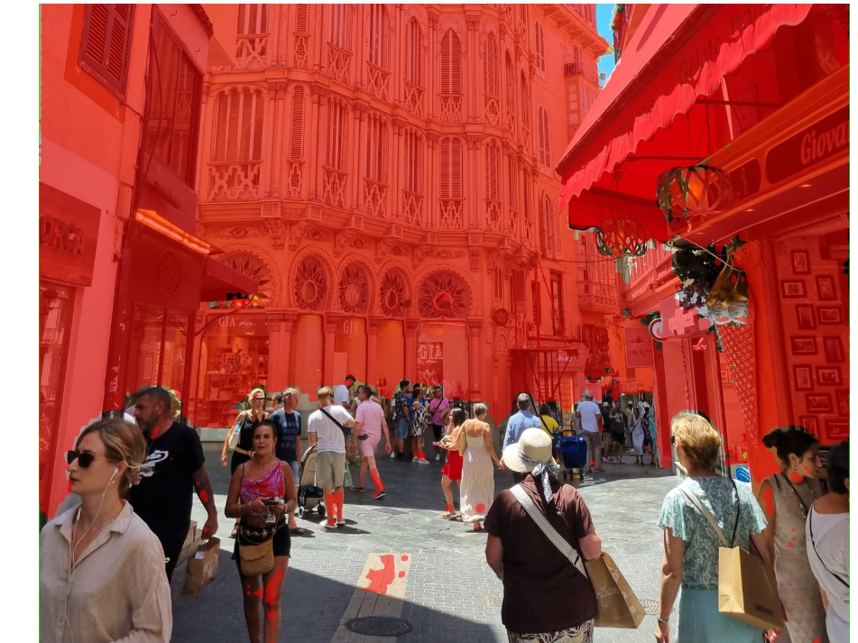

Un point BG sur les bâtiments à l'arrière et un point FG sur le chapeau de la madame au premier plan.

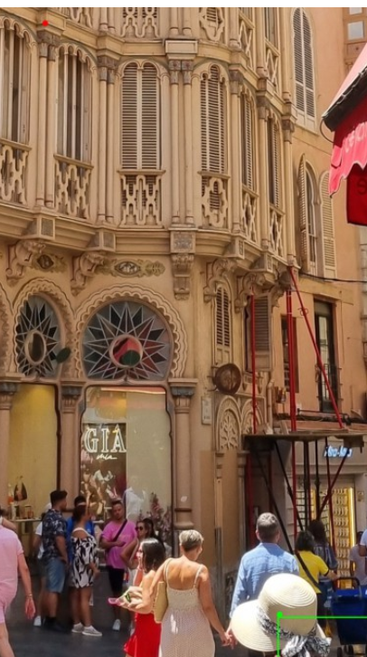

Pas de grande amélioration en comparaison avec la semgmentation sans point.

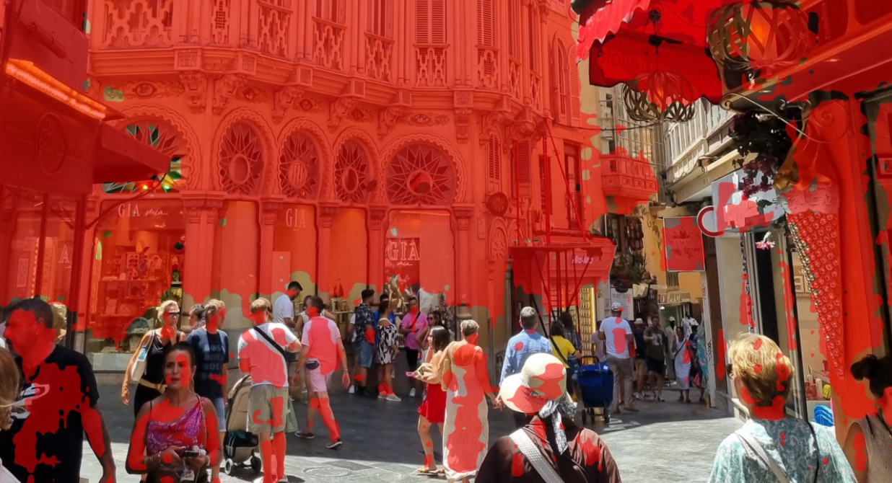

On en déduit que lorsqu'un objet en background prend la plus grande partie de l'img/image, il est compliqué de le faire considéré comme un background. A l'inverse, dans cette situation par rapport aux caméras les "objets" à trouver sont plus excentrés sur le bord de l'écran.

Ils restent tout de même utiles pour indiquer les points importants, comme on le voit sur la première amélioration. Quand une grande quantité d'objet réside dans la boîte d'observation. On remarque dans le même temps que le masque reconnait la vitre comme un objet, elle peut facilement se confondre avec les caméras.

## Exercice 7

### Question 7.a

Dans un fond complexe, comme celui issu des bâtiments de Palma de Majorque, le masque a du mal à reconnaître les objets source de considération.
La transparence, le reflet et le fait que la couleur du fond à gauche ressemble aux caméras sur la première situation. Cela peut être difficile de complètement supprimer cette partie lors des inférences. Par ailleurs, on a noté que lorsque la box est remplie d'un grand nombre d'objets distincts, il peut se perdre sur les différentes particularités. 

### Question 7.b

En me reposant sur les concepts appris lors des précédents cours, je dirais qu'il faudrait mesurer les scores des img/images obtenus selon une catégorisation qu'on aurait préalablement fait (img/image simple, modérée, difficile).
J'établierais une mesure de la courverture du masque par rapport à la taille de l'img/image, si le masque couvre l'entièreté de l'img/image il y a un problème.
On peut mesurer le nombre de d'objets reconnus en espérant obtenir une loi normale au début. Ainsi mesurer un drift du modèle au fil des jours avec une augmentation ou une décroissance notable.
La latence pourrait représenter une métrique intéressante, pareil en trouvant des deltas de latence au fil de l'utilisation cela pourrait révéler des anomalies.
Vérifier que le modèle est déterministe, avec la même img/image les mêmes points, la même box, les mêmes masques... on obtienne toujours le même résultat.

