# TP2 

## Exercice 1 

### Question 1.c

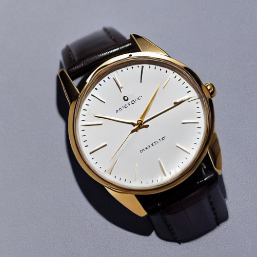

Aucun correctif n'a été nécessaire.

## Exercice 2

## Question 2.b

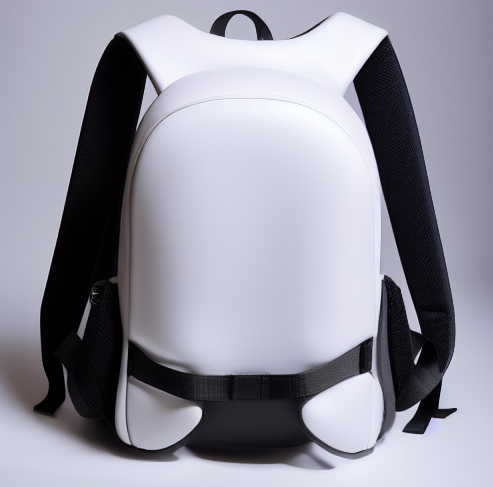

```yaml

CONFIG: {'model_id': 'stable-diffusion-v1-5/stable-diffusion-v1-5', 'scheduler': 'EulerA', 'seed': 42, 'steps': 30, 'guidance': 7.5}

```

## Exercice 3

### Question 3.c

| Expérience | Image | Paramètre Clé |
| :--- | :---: | :--- |
| **01. Baseline** | 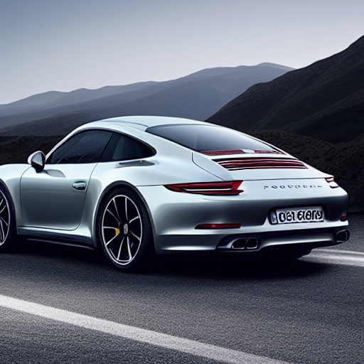 | EulerA, 30 steps, G=7.5 |
| **02. Steps Bas** | 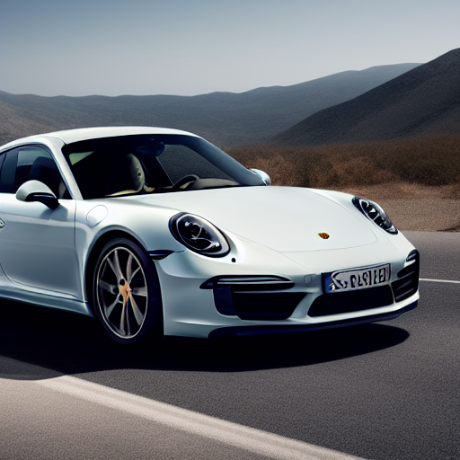 | 15 steps (Rapide) |
| **03. Steps Haut** | 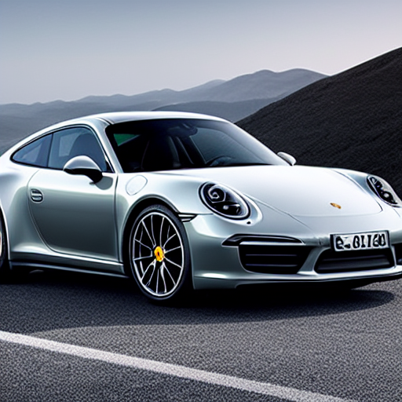 | 50 steps (Précis) |
| **04. Guidance Bas** | 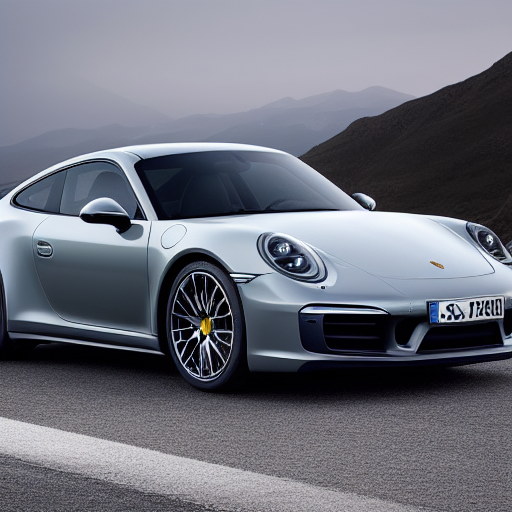 | G=4.0 (Libre) |
| **05. Guidance Haut** | 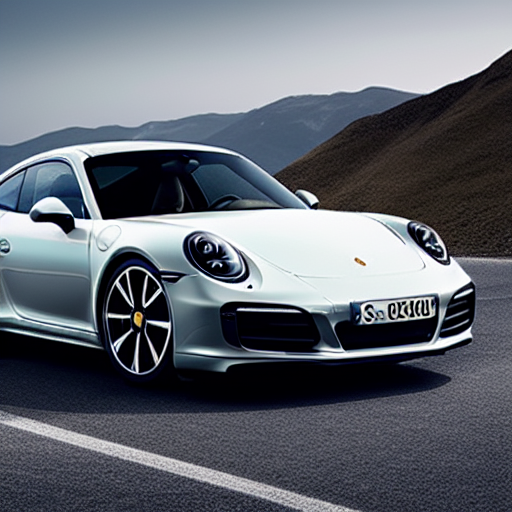 | G=12.0 (Strict) |
| **06. Scheduler** | 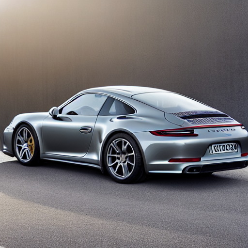 | DDIM (Différent) |

Le changement du nombre de steps nous montre une version de 15 étapes qui ne respecte pas tout a fait la couleur, la lumière n'est pas complètement bien gérée, les jantes sont troubles et les logos moches.
Lorsqu'on l'augmente largement tous ces détails apparaissent avec une bien meilleure définition. Pourtant on observe tout de même que les phares sont en forme de tourbillons sur l'image à 50 steps.
Avec une guidance de 4, la voiture est superbe, tous les détails sont controlés et semblent plutôt réalistes. La guidance haute produit un effet plus cartoonesque et moins réaliste que la version précédente.
Le DDIM met la voiture dans l'autre sens,n la voiture semble cabosser mais la texture trop lisse. Les détails ne sont pas réalistes et même le fond change par rapport à la baseline.

## Exercice 4

### Question 4.c

| Expérience | Image
| :--- | :---: | :--- |
| **01. Strength035** | 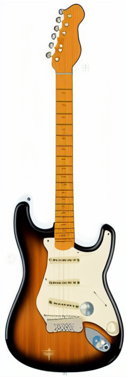 |
| **02. Strength060** | 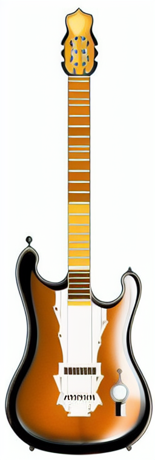 |
| **03. Strength085** | 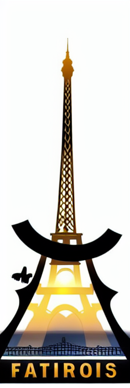 |

suite à une image noire, j'ai dû ajouter la ligne de code suivante : pipe.safety_checker = None

La même structure, forme et orientation apparaissent entre le strength 035 et 085. De même les couleurs restent aussi dans le même thème que l'image de la guitare aux dépends du gris de la tour eiffel.

On constate que la guitare disparait completement au profil des caractéristiques de la tour eiffel. Le manche devient les structures reconnaissables entre mille de la tour. Une écriture a aussi été ajoutée voulant probablement écrire paris.

Cela pourrait donner naissance à des images plus créatives au niveau du e commerce en ajoutant des effets spéciaux, des fonds différents ou même modifier des anomalies qui nécessiterait auparavant d'un montage photo.

## Exercice 5

### Question 5.c

#### Text2Img

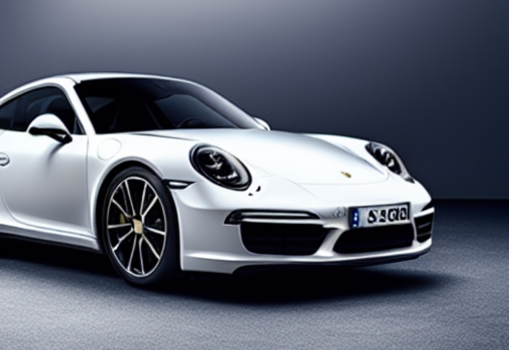

```json

{
"mode":"Text2Img"
"model_id":"stable-diffusion-v1-5/stable-diffusion-v1-5"
"scheduler":"EulerA"
"seed":42
"steps":30
"guidance":7.5
"height":512
"width":512
}

```

#### Img2Img

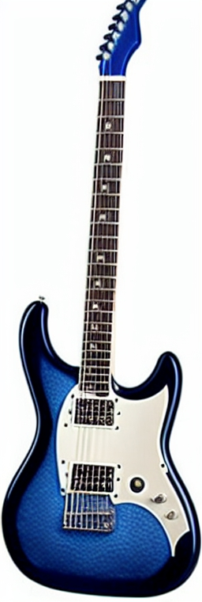

```json

{
"mode":"Img2Img"
"model_id":"stable-diffusion-v1-5/stable-diffusion-v1-5"
"scheduler":"EulerA"
"seed":42
"steps":60
"guidance":15
"strength":0.95
"height":512
"width":512
}

```

## Exercice 6

### Question 6.b

| Critères | Image #1 (Baseline) | Image #2 (Extreme) | Image #3 (I2I Strength Haut) |
| :--- | :---: | :---: | :---: |
| **Prompt adherence** (Fidélité au texte) | 2 | 2 | 1 |
| **Visual realism** (Réalisme photo) | 2 | 2 | 0 |
| **Artifacts** (2 = aucun défaut gênant) | 1 | 2 | 0 |
| **E-commerce usability** (Potentiel commercial) | 0 | 1 | 0 |
| **Reproducibility** (Paramètres complets) | 2 | 2 | 2 |
| **TOTAL / 10** | **7 / 10** | **9 / 10** | **3 / 10** |


Totalement en cohérence avec le prompt, très réaliste, presqu'une qualité photo, quelques défauts sur les détails. La qualité n'est pas encore parfaite pour être publiée. Nous pouvons obtenir la même qualité de photo avec les mêmes paramètres.


Image super réaliste très proche du prompt originel répond à toutes les attentes, toujours quelques corrections de détails manquants mais convaincant.


Un peu plus de créativité en passant d'un objet à un autre mais c'est sur une bonne voie si nous voulons manipuler une image comme nous le souhaitons. Des ajouts sont faits de symboles aléatoires sans réel sens.

### Question 6.c

Pendant le TP, on a bien vu qu'il y a un vrai équilibre à trouver entre qualité et rapidité. Par exemple, monter à 50 steps apporte un peu plus de finesse dans les détails par rapport à 30, et même si ça demande beaucoup plus de calculs, le résultat reste assez convaincant. Pour la reproductibilité, c'est impératif de bien noter la seed et tous les réglages, sinon on ne peut jamais retomber sur le même rendu. Le plus gros risque pour un site e-commerce, c'est que l'IA se mette à "halluciner" : j'ai remarqué qu'avec un strength à 0.85, le produit dérive trop et ne ressemble plus du tout à l'original. Pour éviter de faire de la publicité mensongère, il faut vraiment rester le plus réaliste possible et garder un contrôle strict sur les formes pour que le client reçoive exactement ce qu'il voit à l'écran.