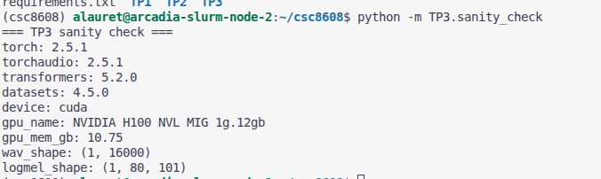
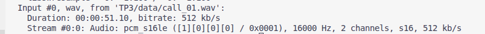
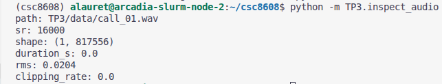
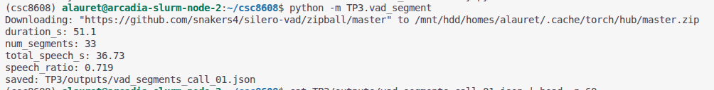
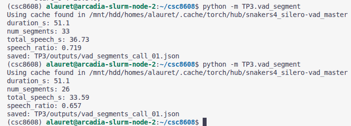
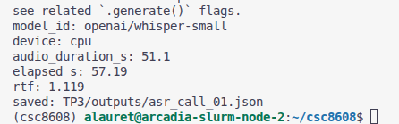
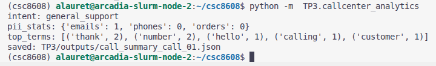
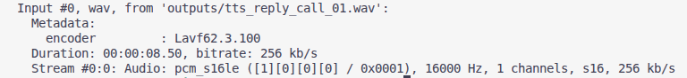
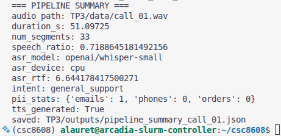

# TP3

## Exercice 1 

### Question 1.c



## Exercice 2

### Question 2.c



### Question 2.e



## Exercice 3

### Question 3.b



```json

{
  "audio_path": "TP3/data/call_01.wav",
  "sample_rate": 16000,
  "duration_s": 51.09725,
  "min_segment_s": 0.3,
  "segments": [
    {
      "start_s": 1.954,
      "end_s": 2.366
    },
    {
      "start_s": 2.818,
      "end_s": 5.662
    },
    {
      "start_s": 6.274,
      "end_s": 7.838
    },
    {
      "start_s": 8.034,
      "end_s": 9.502
    },
    {
      "start_s": 10.242,
      "end_s": 12.19
    }
    ]
}

```

### Question 3.c

Les différents timestamps correspondent bien à mes pauses et les mots que je prononce de 1.9s à 2.4s on entend bien "Hello" puis le deuxième, plus long correspond à "thank you for calling customer support".

### Question 3.d



En réduisant le min_dur_s de 0.3 à 0.1, nous obtenons exactement les mêmes métriques, cependant lorsqu'on augmente de 0.3 à 0.5 on obtient mois de segments distincts. En parallèle, nous avons une durée plus courte définie comme speech donc un plus faible speech ratio.

## Exercice 4

### Question 4.d



L'ensemble du texte a une bonne séparation par rapport aux respirations et aux pauses selon les mots énoncés. Cependant nous pouvons observer quelques fois où des "." apparaissent avant la fin de la phrase (segment 9) ou bien des mots mal diserné, comme au segment 4 "calling" -> "cutting".

## Exercice 5

### Question 5.c

```json
{
  "audio_path": "TP3/data/call_01.wav",
  "model_id": "openai/whisper-small",
  "device": "cpu",
  "audio_duration_s": 51.09725,
  "elapsed_s": 57.185253620147705,
  "rtf": 1.119145426028753,
  "pii_stats": {
    "emails": 0,
    "phones": 0
  },
  "intent_scores": {
    "refund_or_replacement": 4,
    "delivery_issue": 4,
    "general_support": 5
  },
  "intent": "general_support",
  "top_terms": [
    [
      "nine",
      3
    ],
    [
      "five",
      3
    ]
}
```

### Question 5.e



```json

{
  "audio_path": "TP3/data/call_01.wav",
  "model_id": "openai/whisper-small",
  "device": "cpu",
  "audio_duration_s": 51.09725,
  "elapsed_s": 57.185253620147705,
  "rtf": 1.119145426028753,
  "pii_stats": {
    "emails": 1,
    "phones": 0,
    "orders": 0
  },
  "intent_scores": {
    "refund_or_replacement": 4,
    "delivery_issue": 4,
    "general_support": 5
  },
  "intent": "general_support",
  "top_terms": [
    [
      "thank",
      2
    ],
    [
      "number",
      2
    ]
}

```

### Question 5.f
On observe que le nouveau script a bien détecté l'email et a amélioré les numéros. Par contre certains mots naturels de la langue anglaise ont été retranscrits en chiffre comme "for" ou "to". Le numéro de téléphone et le numéro de commande ne sont pas détectés comme tels.
En plus de cela on observe que le "order" est détecté comme "other" par la transcription Whisper, cela peut être la cause de la mauvaise détection du numéro de commande.

## Exercice 6

### Question 6.b

```bash

tts_model_id: facebook/mms-tts-eng
device: cpu
audio_dur_s: 8.5
elapsed_s: 6.75
rtf: 0.795
saved: outputs/tts_reply_call_01.wav

```

### Question 6.c



### Question 6.d

La voix est robotique et on identifie bien que c'est de l'intelligence artificielle. La réponse est concise traite le sujet et est correctement adaptée à la situation. Il dit être désolé pour la commande et nous propose les possibilités de remboursement ou de remplacement. La prosodie est claire et nous comprenons bien ce qu'il dit.

### Question 6.e

```text
text: Thanks for calling. I am sorry your order arrived. Image, I can offer a replacement or a refund. Please confirm your preferred option.
```

On observe que la voix est intelligible selon whisper car c'est correctement retranscrit. Seul un mot est mal capté "Image" à la place de "damaged" à l'origine.

## Exercice 7

### Question 7.b



### Question 7.d

Le goulot d'étranglement se trouve à l'étape de whisper. En plus d'être lent, on observe qu'il se trompe sur des mots pouvant ainsi changer le sens entier de la phrase. Cela est dangereux car peut entraîner de mauvaises réponses. Cette étape est donc très fragile, il faut faire attention de l'encadrer.
Ce que je ferai pour mettre en production est, si nous avons les ressources suffisantes, mettre en place deux whisper qui traitent l'audio en parallèle et traiter les sorties avec un LLM entraîné à corriger et prendre les mots/phrases les plus vraisemblables. Nous pouvons faire un prétraitement de l'audio d'origine en avant pour supprimer les bruits. Ce qui peut se faire ausi est l'amélioration du PII car ici l'email et reconnu mais pas le reste ce qui peut entraîner des risques de sécurité, un stockage mal fait ou des actions supplémentaires qui auraient pu être menées par des agents par la suite.