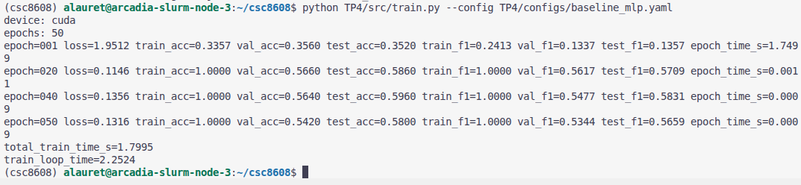
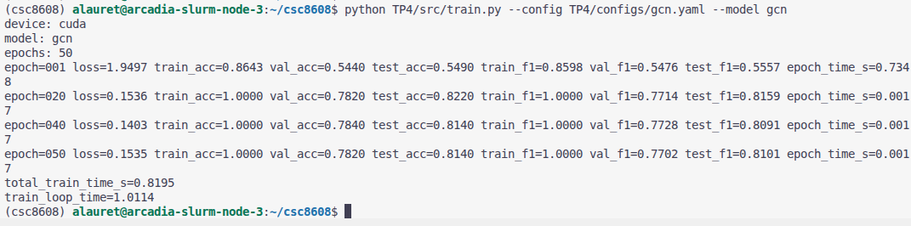
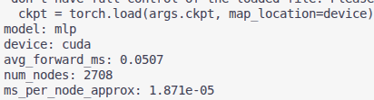
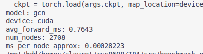
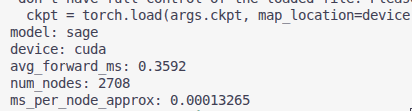

# TP4

## Exercice 1

### Question 1.a

### Question 1.e

## Exercice 2

### Question 2.g

Nous calculons séparément les métriques des 3 datasets pour observer un comportement normal d'un entrainement sans faire de dataleakage en entraînant le modèle sur les données de test par exemple.
On peut aussi grâce à cela voir si le modèle généralise correctement et s'il overfit sur le val.

### Question 2.h

## Exercice 3

### Question 3.e

| Modèle | test_acc | test_f1 | temps (train_loop) |
| :--- | :---: | :---: | :---: |
| **Baseline MLP** | 0.5800 | 0.5659 | 2.25s |
| **GCN** | 0.8140 | 0.8101 | 1.01s |

### Question 3.f

Le GCN a des scores bien meilleurs que le MLP sur Cora avec 23 pourcents en plus car il prend en compte la structure du graphe au lieu de regarder chaque papier de façon isolée. Dans ce dataset il y a une forte homophilie ce qui veut dire que les articles connectés par des citations traitent souvent du même sujet. Le GCN va donc utiliser les informations du voisinage pour lisser et corriger les features textuelles qui peuvent être un peu incomplètes. Il se sert du contexte relationnel du réseau pour combler les manques quand les mots clés d'un article ne suffisent pas à bien le classer.

## Exercice 4

### Question 4.e

| Modèle | test_acc | test_f1 | temps |
| :--- | :---: | :---: | :---: |
| Baseline MLP | 0.5800 | 0.5659 | 2.25s |
| GCN | 0.8140 | 0.8101 | 1.01s |
| GraphSAGE | 0.7870 | 0.7860 | 0.96s |

### Question 4.f

Le neighbor sampling permet surtout d'éviter l'explosion combinatoire en limitant le nombre de voisins qu'on explore grâce au fanout. Ça nous permet de tourner sur des mini-batchs de taille fixe au lieu de charger tout le graphe d'un coup en mémoire ce qui accélère bien l'entraînement. Il faut juste faire attention au coût CPU quand on génère les sous-graphes.

Par contre le fait de tirer les voisins au hasard rajoute forcément du bruit dans l'estimation du gradient. Cela augmente la variance de l'apprentissage et ça impacte surtout les hubs puisqu'on ignore une grosse partie de leurs connexions. Au final c'est un compromis entre la capacité à passer à l'échelle sur des gros datasets et la précision pure qu'on aurait avec un GCN complet.

## Exercice 5

### Question 5.d

| Modèle | avg_forward_ms | ms_per_node_approx |
| :--- | :---: | :---: |
| MLP | 0.0507 | 0.00001871 |
| GCN | 0.7643 | 0.00028223 |
| GraphSAGE | 0.3592 | 0.00013265 |

### Question 5.e

Le warmup, c'est pour éviter de mesurer les lenteurs du premier passage. Au début, le GPU doit initialiser ses kernels et allouer la mémoire, donc c'est forcément plus long. En faisant quelques runs à vide, on stabilise les perfs pour mesurer le modèle en "régime de croisière".

Pour la synchronisation CUDA, c'est parce que le GPU est asynchrone, le CPU envoie les commandes et continue sa vie sans attendre la fin du calcul. Si on ne synchronise pas, notre timer mesurerait juste le temps d'envoi de l'ordre, pas le calcul lui-même. En forçant la synchro avant et après, on s'assure que le CPU attend que le GPU ait vraiment fini pour arrêter le chrono.

## Exercice 6

### Question 6.b

| Modèle | test_acc | test_macro_f1 | total_train_time_s | train_loop_time | avg_forward_ms |
| :--- | :---: | :---: | :---: | :---: | :---: |
| MLP | 0.5800 | 0.5659 | 1.7995 | 2.2524 | 0.0507 |
| GCN | 0.8140 | 0.8101 | 0.8195 | 1.0114 | 0.7643 |
| GraphSAGE | 0.7870 | 0.7860 | 0.6937 | 0.9560 | 0.3592 |

### Question 6.c

D'un point de vue ingénieur, le choix dépend du compromis entre précision et ressources. Si la priorité est la qualité pure, le GCN est le meilleur choix car il atteint l'accuracy la plus élevée (0.8140) en exploitant tout le graphe. Pour un système où la latence d'inférence est critique (ex: temps réel), le MLP est imbattable avec seulement 0.05 ms par forward, mais au prix d'une perte énorme de performance (23% d'accuracy en moins).

Enfin, pour des projets à grande échelle (gros graphes), je recommande GraphSAGE. Il offre un excellent compromis : il est 2x plus rapide que le GCN en inférence (0.35 ms) et possède le temps d'entraînement le plus court (0.69s) grâce au sampling, tout en restant très proche des performances du GCN (0.7870 d'acc). C'est la solution la plus scalable.

### Question 6.d

Un risque majeur qui pourrait fausser cette comparaison est le manque de fixité des seeds. Les réseaux de neurones sont sensibles à l'initialisation aléatoire ; une "bonne" seed pourrait faire briller un modèle moins performant par chance. Dans un vrai projet, j'utiliserais une validation croisée (K-Fold) ou je ferais la moyenne des scores sur 5 à 10 lancements avec des seeds différentes pour garantir la robustesse des résultats.

Un autre point crucial est la cohérence de l'environnement de mesure. Comparer un MLP sur CPU et un GCN sur GPU n'aurait aucun sens. Ici, on a bien tout synchronisé sur CUDA avec un warmup, ce qui évite les mesures aberrantes liées à l'initialisation du hardware.

### Question 6.e

Le dépôt est propre et contient uniquement le nécessaire : le rapport, les scripts et les fichiers de configuration. Aucun fichier volumineux (dataset, checkpoints .pt ou logs massifs) n'a été commité.