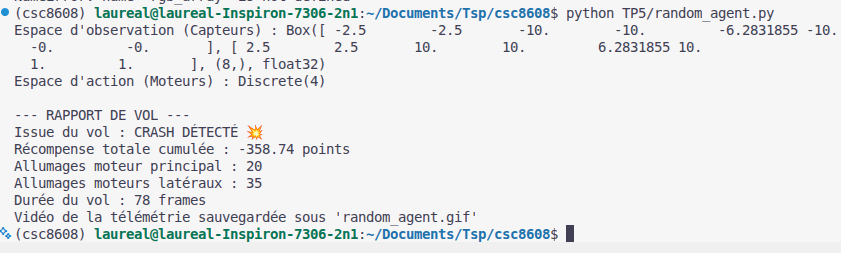
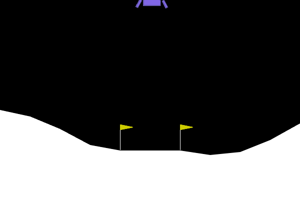
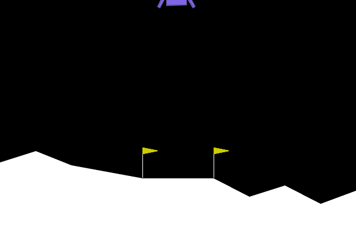
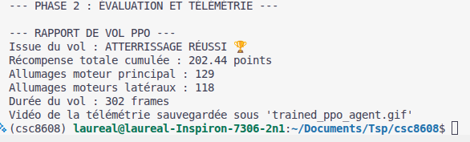
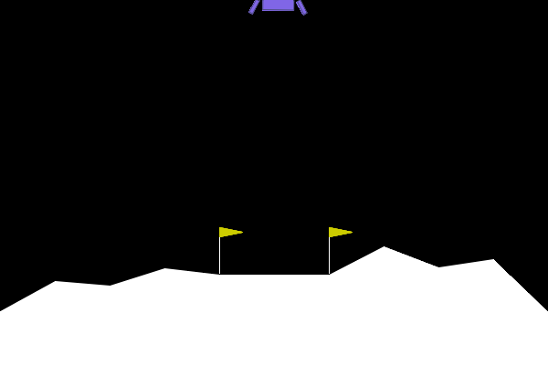
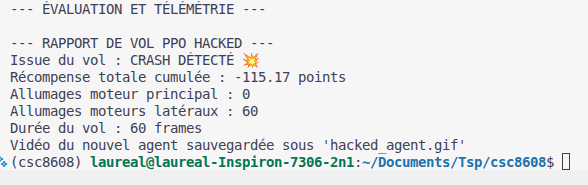
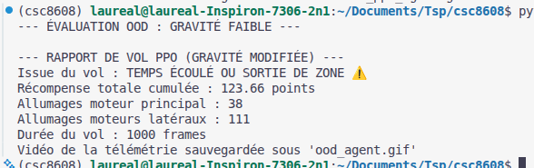
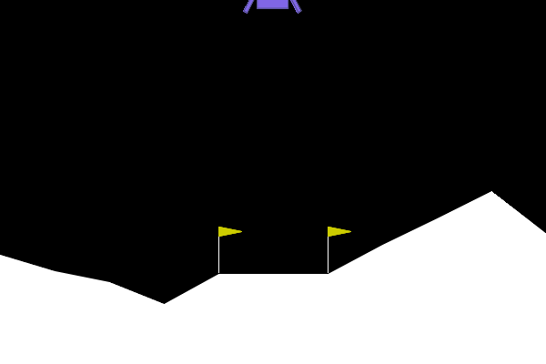

# TP5

## Exercice 1

### Question 1.b

On observe que le score de -300 est très très loin du score moyen de 200 qui permettrait de se dire que l'agent maîtrise l'environnement.

## Exercice 2

### Question 2.b

L'agent a bien atteint le score de 200 points permettant de valider le "contrôle" de l'environnement. On a pu observer lors de l'entrainement que ep_rew_mean a augmenté tout au long, hormis lors de quelques plateaux.
La durée de vol est plus longue que dans le premier cas et les moteurs s'allument beaucoup plus, cela montre aussi le contrôle qu'a l'agent sur les différentes actions par rapport à son état courant.

## Exercice 3

### Question 3.b

Chaque fois que le moteur principal est allumé, la reward fait perdre 50 points. L'agent prend en compte le fait qu'il gagnera donc plus de point à ne jamais utiliser le moteur principal, quitte à ne pas atteindre la destination sans se crasher. Avec la méthodologie juste avant, on aurait -6250 de score.

## Exercice 4

### Question 4.b

On observe que le score est assez bon pour un changement d'environnement. Il parvient à se poser cependant il se pose sur une pente ce qui ne lui permet pas d'être stable il continue à utiliser son moteur latéral.

## Exercice 5

### Question 5.a

Nous pourrions ajouter une variable aléatoire sur la gravité que nous avons. Par ailleurs, nous pourrions ajouter un taux d'aléatoire sur la réussite de l'utilisation des moteurs.

