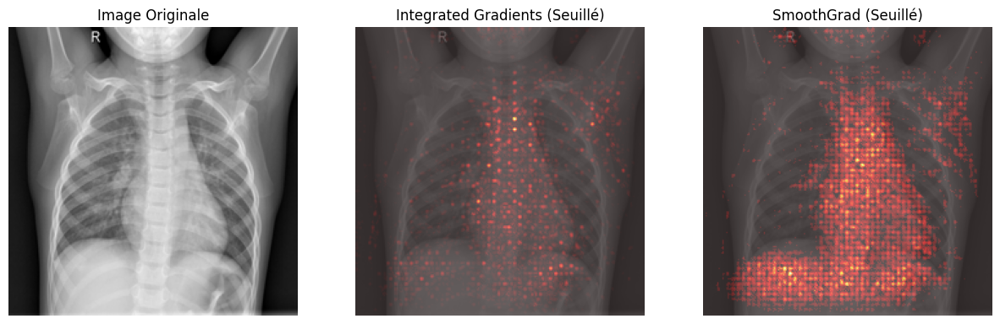
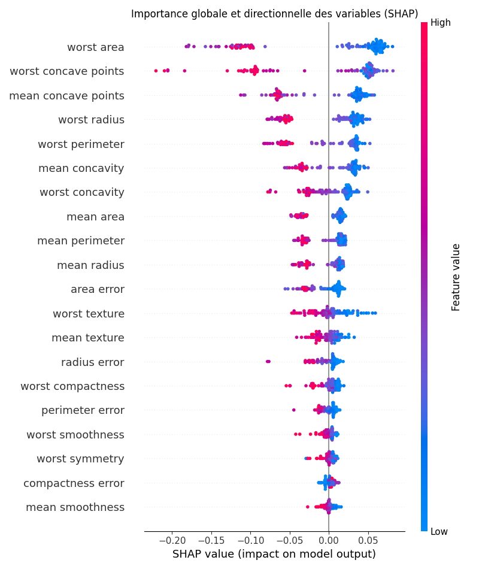

# TP6

## Exercice 1 

### Question 1.d

Pour cette question, les radio normales ressortent correctement en classement normal et les pneumonies en pneumonie. Le modèle correspond bien à ce qu'on attend comme résultat.
Cependant l'effet clever hans apparaît car le modèle observe principalement la colonne vertébral pour détecter les cas de pneumonie. Par contre, lorsqu'il classe les radios en normal l'observation se porte d'avantage sur les poumons.
Les explications sont de "gros" pixels, cela s'explique car la résolution d'étude dans les couches profondes est plus basse. Un pixel sélectionné pour cette couche profonde devient plus grande lors de la récupération de la résolution de l'image.

## Exercice 2

### Question 2.b

Au vu de la différence de latence entre Integrated Gradients et SmoothGrad, 1 et 14 secondes nous ne pouvons pas avoir d'analyse au temps réel complet le mieux serait d'utiliser le gradcam puisque ça a bien trouvé les maladies instantanément. Si nous pouvons permettre 1 seconde de latence le plus précis serait Integrated Gradients avec une analyse post observation encore plus précise avec un rapport final créé par Smooth Grad.

Le fait de pouvoir prendre en compte des features inférieurs à 0 permet d'éloigner le modèle d'une décision en indiquant des caractéristiques contraires à la pneumonie.

## Exercice 3

### Question 3.c

Le glassbox montre que les 3 caractéristiques de décision principales sont : worst_textures, radius_error et worst_symmetry.
L'explication de ce modèle directement interprétable permet d'augmenter la compréhension du fonctionnement du modèle. Lors des méthodes précédentes la carte des chaleurs permettait de comprendre les lieux auxquels le modèle s'intéressait. Maintenant nous avons les données précises sur lequel le modèle travaille, nous n'avons pas seulement l'emplacement mais aussi les précisions.

## Exercice 4

### Question 4.

Les caractéristiques ayant le plus d'impacts sur la décision finale ne sont pas similaires aux caractéristiques trouvées par la Regression Logistique. La robustesse de ces caractéristiques est donc faible.

Pour le patient 0, l'explication locale de shap waterfall nous indique que le critère numéro 1 de décision est worst area avec une valeur de 677.9.